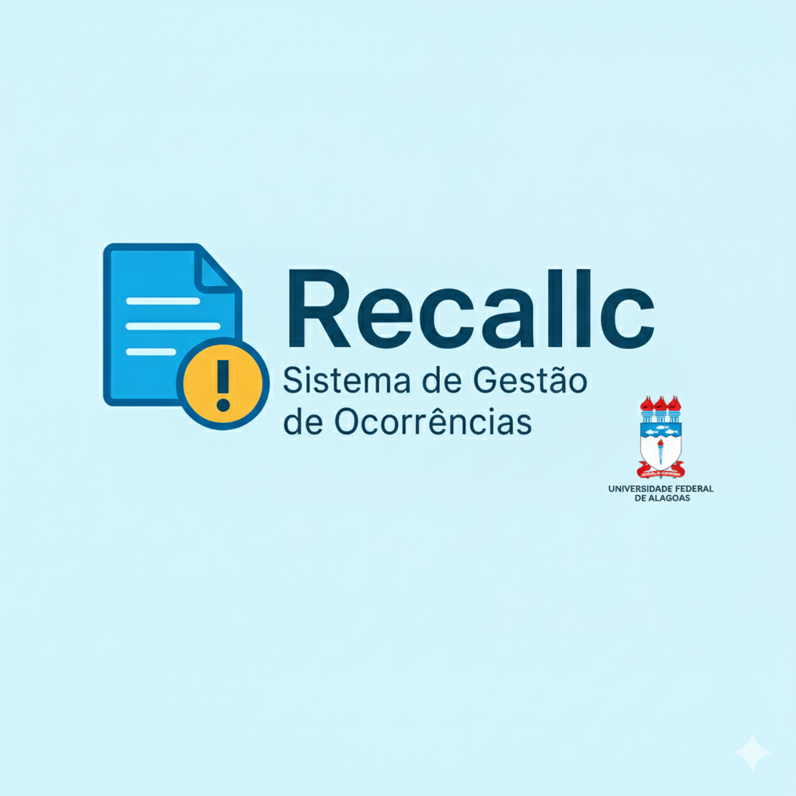

  
  

  # **RecalIC: Sistema de  Gestão de Ocorrências**
  
  

  

  > A ponte direta entre a comunidade acadêmica e a solução de problemas no Instituto de Computação da UFAL.

## 🎯 Qual o objetivo?

O **RecalIC** é uma plataforma web criada para simplificar a forma como problemas de infraestrutura (como uma cadeira quebrada, uma lâmpada queimada ou um problema no ar-condicionado) são reportados e resolvidos.

- **Para quem reporta:** Agilidade e transparência.
- **Para quem resolve:** Organização e eficiência.

---

## ✨ Funcionalidades Principais

### 👤 **Para a Comunidade (Relatores)**

| Funcionalidade | Descrição | Ícone |
| :--- | :--- | :---: |
| **Registro Rápido** | Crie um novo relato de avaria em segundos, com campos simples e diretos. | 📝 |
| **Evidências Visuais** | Anexe fotos do problema para facilitar a identificação e o conserto. | 📸 |
| **Acompanhamento Real** | Veja o status da sua solicitação (Aberto, Em Análise, Resolvido) em tempo real. | 📊 |

 

### 🛠️ **Para a Gestão (Administradores e Técnicos)**

| Funcionalidade | Descrição | Ícone |
| :--- | :--- | :---: |
| **Painel Centralizado** | Visualize e gerencie todas as ocorrências registradas em uma única tela. | 🎛️ |
| **Filtros Inteligentes**| Encontre relatos por status, local, categoria ou data com facilidade. | 🔎 |
| **Gestão de Status** | Atualize o andamento, adicione comentários e mantenha o relator sempre informado. | 🔄 |

---

## 👨‍💻 Equipe por Trás do Projeto

Este projeto está sendo desenvolvido com dedicação pelos seguintes membros:

- **[José Herberty de Oliveira Freire](https://github.com/HerbertyFreire)** - *Estudante de Ciência da Computação*
- **[Leonardo Barbosa Barros](https://github.com/leonardobrrs)** - *Estudante de Ciência da Computação*
- **[Felipe Gabriel Marques dos Santos](https://github.com/22felipe)** - *Estudante de Ciência da Computação*
- **[Thyago Viana Pereira](https://github.com/thyagoviana)** - *Estudante de Ciência da Computação*
- **[Thiago dos Santos Pontes](https://github.com/thiagodsp-max)** - *Estudante de Ciência da Computação*

---

  
Feito para a comunidade do <strong>Instituto de Computação</strong>.

